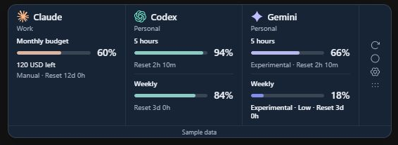
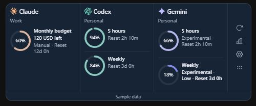

# TokenFuel

A Windows desktop widget for remaining AI subscription allowances. First release: **0.1.0**; MIT licensed. The compact soft-glass widget switches between Slim Strip and Mini Rings. Each connected account shows all reported quota windows separately, including weekly and monthly allowances when available, with remaining values and reset countdowns. Pinning moves a quota first without hiding other pools. Only enabled connections appear; one Connect tile stays visible when none are enabled. It includes separate account/workspace pools, tray controls, remembered position, optional startup and threshold alerts.

## Widget preview

**Compact bars** — separate remaining allowances and reset countdowns.



**Circular gauges** — remaining percentages centred inside each quota's gauge.



Screenshots show the current UI with fictional sample data. The widget displays only connected accounts and quota windows reported by the selected source; these examples do not certify live support for every subscription tier.

## Install and run

**Recommended: download the Windows installer.** No Git, GitHub CLI, Rust, Node, pnpm or Python is needed to run the prebuilt app.

1. Sign in to GitHub in your browser and open [TokenFuel releases](https://github.com/tejas20/TokenFuel/releases).
2. Open release `v0.1.0` and download `TokenFuel_0.1.0_x64-setup.exe`.
3. Run the installer, then open TokenFuel from the Start menu. Open Settings to connect your accounts; Windows startup is opt-in.

Requires Windows 10/11 x64. The installer installs for the current user and includes a Microsoft WebView2 bootstrapper to install the runtime if missing (internet required). Use `TokenFuel_0.1.0_x64-offline-setup.exe` when installation must work without downloading WebView2. **The repository is private:** download access requires repository read access. The binaries are unsigned. Native ARM64 and 32-bit builds are not included.

**Portable alternative:** download `TokenFuel_0.1.0_x64-portable.zip` from the same release, extract it, and double-click `TokenFuel.exe`. WebView2 must already be installed. Configuration and credentials still use Windows application storage.

See the [installation guide](docs/installation.md) for checksums, updates, access troubleshooting and the optional launcher.

### Optional: start the private release in one command

For testers who already use Git and [GitHub CLI](https://cli.github.com/), authenticate once with `gh auth login` using an account with repository read access. From a parent folder without an existing `TokenFuel` checkout, run in PowerShell:

```powershell
gh repo clone tejas20/TokenFuel
if ($LASTEXITCODE -eq 0) { .\TokenFuel\Start-TokenFuel.cmd }
```

From an existing checkout, the single command is `.\Start-TokenFuel.cmd`. It downloads the prebuilt app, verifies the ZIP against the release's SHA-256 checksum and caches it under `%LOCALAPPDATA%\TokenFuel\Preview\v0.1.0`. Subsequent launches verify the cached executable against its local checksum. It needs no developer toolchain, but WebView2 must already be installed. The launcher is pinned to this release; it does not automatically update. Checksums check file integrity; they do not replace publisher code signing. When upgrading an older checkout, quit TokenFuel from its tray menu, run `git pull --ff-only`, then run the launcher again.

### Connect accounts

First run: Settings opens automatically. Choose your provider, allow that connection, and Save. Supported local sources automatically find an existing signed-in app or CLI after consent. Advanced workspace and secret fields are optional; token fields appear only for sources that support them. OpenAI defaults to the installed Codex session; it tracks **Codex pools**, not all ChatGPT chat models. For Gemini, choose **Gemini live Usage view · experimental**, enable the two consent controls, Save, then open the isolated window and sign in. Keep that window open; polling reloads only `/usage` every two minutes and checks the provider's freshness label. Click Refresh after signing in. The separate **Usage view · experimental capture** source is an explicit snapshot, **not automatic tracking**. Refresh the provider view before capturing; unsupported or ambiguous counters stay unavailable. Reading ages and stale labels stay visible.

## Provider support

| Provider | Connection | Current validation |
|---|---|---|
| OpenAI | Installed Codex app-server, documented `account/rateLimits/read` | Live quota read succeeded on this PC; ordinary ChatGPT counters remain unsupported |
| Claude | Experimental Claude Code OAuth usage endpoint | Synthetic payload tests include personal windows and member monthly monetary limits; live office verification outstanding |
| Gemini | Experimental live Usage WebView polling | Quota-only DOM parser matched this PC's signed-in PRO Usage page; native isolated-window polling still needs verification |
| Claude / Gemini / ChatGPT | Isolated, session-only sign-in window; explicit visible Usage capture | Experimental, conservative DOM parser; signed-in provider validation outstanding |
| All supported providers | Manual percentage / decimal budget / unlimited snapshots | Clearly manual; never verified automatic tracking |
| OpenCode Go | Experimental Go status; monitor configuration or account secret | Synthetic fixtures only; live validation outstanding |
| Cursor | Experimental local Cursor sign-in and usage summary | Synthetic fixtures only; live validation outstanding |
| Grok | Experimental Grok CLI auth and Build credits | Synthetic fixtures only; ordinary Grok chat counters unsupported |
| GitHub Copilot | Existing Copilot / GitHub CLI sign-in and quota endpoint | Synthetic fixtures only; live validation outstanding |
| Google Antigravity | Experimental local sign-in and model quotas | Synthetic fixtures only; live validation outstanding |

Codex counters are labelled Codex. They do not represent every ordinary ChatGPT model. Browser capture does not reload a provider page or infer reset dates, window limits, or currency. Refresh the provider's Usage view before capturing. Google or enterprise SSO may reject embedded sign-in; use manual snapshots if that happens. Enterprise monthly support remains provisional until compared on the office laptop.

## Develop from source

Windows 10/11 x64, WebView2, Git, Node.js 24+, pnpm 11.19.0, Rust 1.99.0 MSVC, Visual Studio 2022 C++ build tools and Windows SDK.

These tools are only required for building from source. See [development setup](docs/setup.md); app users can use the installer above.

```powershell
pnpm install --frozen-lockfile
pnpm tauri dev
# Browser-only design preview, with labelled sample data:
pnpm dev
# http://127.0.0.1:1420/?demo=1
cargo test --workspace
cargo clippy --workspace --all-targets -- -D warnings
pnpm test
pnpm tauri build
```

Installer: `target/release/bundle/nsis/`. Portable executable: `target/release/tokenfuel.exe` (requires WebView2). Build regular, offline and portable release assets with `powershell -File scripts/package-release.ps1`. Release artifacts are private. Python is optional development tooling, never an app dependency.

## Local data and security

Networking, parsing, credentials, scheduling and calculations live in Rust. React receives decimal strings and normalized snapshots. Local config and quota cache are stored under the Windows application configuration directory for `com.tejas20.tokenfuel`. No conversation content, telemetry or token logging is implemented.

All accounts start disconnected. The connection consent control authorizes existing CLI session access. Experimental connections have a separate opt-in. Claude tokens copied from an authorized local CLI session are protected by Windows Credential Manager (`TokenFuel`, account UUID). Disconnecting stops reads and deletes TokenFuel's saved secret; changing source or removing the account also deletes it. Account-specific secrets never fall back to another local sign-in when missing. Duplicate launches show the running widget. Original provider credentials are never rewritten. Browser sessions use an incognito WebView and are not persisted across restarts. Provider windows have no local capabilities, and all native application commands additionally validate the calling widget's identity and origin.

Polling defaults to two minutes, with separate account backoff and provider Retry-After floors. Percentages require a supplied percentage or valid denominator. Manual and browser snapshots retain their capture time; cached data and connection errors remain explicit. Monthly reset dates are provider supplied, never assumed to be the first. Notifications fire only on observed downward crossings of 20% and 10%.

See [installation](docs/installation.md), [development setup](docs/setup.md), [office validation](docs/office-validation.md), [research](docs/provider-research.md), and [third-party notices](THIRD_PARTY_NOTICES.md).
