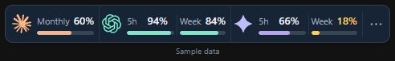
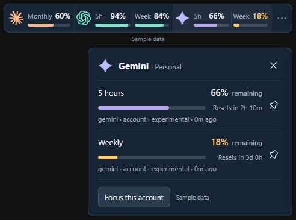
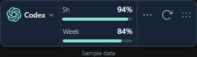

# TokenFuel

[](https://github.com/sponsors/tejas20)

**0.2.0 Windows release:** these downloads include the reviewed widget cleanup: Menu → Refresh → Move controls, vertical controls for multiple providers, horizontal controls for one provider or a focused account, simplified menus and details, and removal of ring view and quota pinning. See the [changelog](CHANGELOG.md).

A Windows desktop widget for remaining AI subscription allowances. Maintained by [@tejas20](https://github.com/tejas20); MIT licensed. A compact widget shows each account's reported quota windows as separate percentages and bars. Click a provider for reset countdowns and connection details, or focus one account in a narrower bar. It includes separate account/workspace pools, tray controls, remembered position, optional startup and threshold alerts.

## Widget preview

**All accounts** — up to 544 px wide, with 48 px provider rows and visible Move, Refresh and Menu controls. Each reported quota has its own label, remaining value and meter; low allowances turn amber. Additional accounts and longer quota names wrap onto visible rows. Generic windows use 5h, Week, Month and Day; named model pools stay separate.



**Provider details on click** — see every quota, reset countdown, source, reading age and reported monetary balance. Choose **Focus this account** to focus its allowances. Close with the cross, click outside, or press Escape.



**Focus mode** — choose **Focus this account** in the details panel or select an account from the menu. The bar starts at 300 px wide and wraps quotas when needed to keep the account selector and controls visible. The selection is saved across restarts; a disabled or removed account falls back to the remaining enabled accounts. The account dropdown switches focus or returns to **All accounts**. An amber count on the menu indicates other accounts with fresh low allowances.



The visible controls are ordered **… menu**, **Refresh**, then **Move**. They stack vertically when multiple providers are visible and stay horizontal for one provider or a focused account. The menu contains Always on top, account focus and Settings. Drag the left edge of the bar or the Move widget control to reposition it. Settings manages connections, theme, opacity, Windows startup, edge snapping, polling and alerts. Stale or failed cached readings are dimmed and marked with a warning; manual snapshots have a pencil marker. Only enabled connections appear, with one Connect tile when none are enabled. Quota windows keep the order reported by their source; saved quota pins are ignored.

These screenshots show the updated 0.2.0 frontend with fictional sample data. The widget displays only accounts and quota windows reported by the selected source; these examples do not certify live support for every subscription tier.

## Install and run

**Recommended: download the Windows installer.** No Git, GitHub CLI, Rust, Node, pnpm or Python is needed to run the prebuilt app.

1. Open [TokenFuel releases](https://github.com/tejas20/TokenFuel/releases).
2. Open release `v0.2.0` and download `TokenFuel_0.2.0_x64-setup.exe`.
3. Run the installer, then open TokenFuel from the Start menu. Supported local sources are detected automatically; use Settings to review connection issues or disable sources. Windows startup is opt-in.

Requires Windows 10/11 x64. The installer installs for the current user and includes a Microsoft WebView2 bootstrapper to install the runtime if missing (internet required). Use `TokenFuel_0.2.0_x64-offline-setup.exe` when installation must work without downloading WebView2. Public downloads need no GitHub account. The binaries are unsigned. Native ARM64 and 32-bit builds are not included.

**Portable alternative:** download `TokenFuel_0.2.0_x64-portable.zip` from the same release, extract it, and double-click `TokenFuel.exe`. WebView2 must already be installed. Configuration and credentials still use Windows application storage.

See the [installation guide](docs/installation.md) for checksums, updates, access troubleshooting and the optional launcher.

**Office PCs:** published 0.2.0 binaries are unsigned. SmartScreen warnings and command-line "Access is denied" need separate diagnosis. In an updated checkout, run `.\Start-TokenFuel.cmd -Diagnose` to inspect the cached app without launching or downloading it. See [managed Windows troubleshooting and WinGet status](docs/installation.md#smartscreen-or-access-is-denied-on-an-office-pc). WinGet manifests can now be generated by maintainers; a TokenFuel package has not been published by this change.

### Optional: start the public release from a checkout

For users who already have Git, run this in PowerShell from a parent folder without an existing `TokenFuel` checkout. The launcher needs neither GitHub CLI nor GitHub sign-in:

```powershell
git clone https://github.com/tejas20/TokenFuel.git
if ($LASTEXITCODE -eq 0) { .\TokenFuel\Start-TokenFuel.cmd }
```

From an existing checkout, the single command is `.\Start-TokenFuel.cmd`. It downloads the prebuilt app, verifies the ZIP against the release's SHA-256 checksum and caches it under `%LOCALAPPDATA%\TokenFuel\Preview\v0.2.0\2026-10-06.3`. This rebuild uses a new cache directory so an earlier 0.2.0 executable is not reused. Subsequent launches verify the cached executable against its local checksum. It needs no developer toolchain, but WebView2 must already be installed. The launcher is pinned to this release; it does not automatically update. Checksums check file integrity; they do not replace publisher code signing. When upgrading an older checkout, quit TokenFuel from its tray menu, run `git pull --ff-only`, then run the launcher again.

### Connect accounts

TokenFuel opens on remaining usage and automatically enables supported local sources found at launch, including experimental adapters. Disabled or removed connections stay disabled. Open Settings for connection issues or to manage accounts. Gemini requires an isolated browser sign-in; installing Gemini alone does not expose its subscription counters. Advanced workspace and secret fields are optional; token fields appear only for sources that support them. OpenAI defaults to the installed Codex session; it tracks **Codex pools**, not all ChatGPT chat models. For Gemini, choose **Gemini live Usage view · experimental**, enable the two consent controls, Save, then open the isolated window and sign in. Keep that window open; polling reloads only `/usage` every two minutes and checks the provider's freshness label. Click Refresh after signing in. The separate **Usage view · experimental capture** source is an explicit snapshot, **not automatic tracking**. Refresh the provider view before capturing; unsupported or ambiguous counters stay unavailable. Reading ages and stale labels stay visible.

## Provider support

| Provider | Connection | Current validation |
|---|---|---|
| OpenAI | Installed Codex app-server, documented `account/rateLimits/read` | Live quota read succeeded on this PC; ordinary ChatGPT counters remain unsupported |
| Claude | Experimental Claude Code OAuth usage endpoint | Synthetic payload tests include personal windows and member monthly monetary limits; live office verification outstanding |
| Gemini | Experimental live Usage WebView polling | Quota-only DOM parser matched this PC's signed-in PRO Usage page; native isolated-window polling still needs verification |
| Claude / Gemini / ChatGPT | Isolated, session-only sign-in window; explicit visible Usage capture | Experimental, conservative DOM parser; signed-in provider validation outstanding |
| All supported providers | Manual percentage / decimal budget / unlimited snapshots | Clearly manual; never verified automatic tracking |
| OpenCode Go | Experimental Go status; monitor configuration or account secret | Synthetic fixtures only; live validation outstanding |
| Cursor | Experimental local Cursor sign-in and usage summary | Synthetic fixtures only; live validation outstanding |
| Grok | Experimental Grok CLI auth and Build credits | Synthetic fixtures only; ordinary Grok chat counters unsupported |
| GitHub Copilot | Existing Copilot / GitHub CLI sign-in and quota endpoint | Live read succeeded on this PC; synthetic Free-plan fixture coverage |
| Google Antigravity | Experimental local sign-in and model quotas | Live read succeeded on this PC; wider plan validation outstanding |

Codex counters are labelled Codex. They do not represent every ordinary ChatGPT model. Browser capture does not reload a provider page or infer reset dates, window limits, or currency. Refresh the provider's Usage view before capturing. Google or enterprise SSO may reject embedded sign-in; use manual snapshots if that happens. Enterprise monthly support remains provisional until compared on the office laptop.

## Develop from source

Windows 10/11 x64, WebView2, Git, Node.js 24+, pnpm 11.19.0, Rust 1.99.0 MSVC, Visual Studio 2022 C++ build tools and Windows SDK.

These tools are only required for building from source. See [development setup](docs/setup.md); app users can use the installer above.

```powershell
pnpm install --frozen-lockfile
pnpm tauri dev
# Browser-only design preview, with labelled sample data:
pnpm dev
# http://127.0.0.1:1420/?demo=1
cargo test --workspace
cargo clippy --workspace --all-targets -- -D warnings
pnpm test
pnpm tauri build
```

Installer: `target/release/bundle/nsis/`. Portable executable: `target/release/tokenfuel.exe` (requires WebView2). Build regular, offline and portable release assets with `powershell -File scripts/package-release.ps1 -SigningConfig <local-signing-config.json>`. Unsigned local/CI test packaging requires an explicit `-AllowUnsigned`. For signing and WinGet preparation, see the [release guide](docs/releasing.md) and [changelog](CHANGELOG.md). Python is optional development tooling, never an app dependency.

## Local data and security

Networking, parsing, credentials, scheduling and calculations live in Rust. React receives decimal strings and normalized snapshots. Local config and quota cache are stored under the Windows application configuration directory for `com.tejas20.tokenfuel`. No conversation content, telemetry or token logging is implemented.

Detected local sources automatically reuse existing app/CLI sign-ins for quota reads. Experimental local adapters are enabled when detected and remain labelled experimental. You can disable any connection in Settings; browser sources still require manual enablement. Claude tokens copied from an authorized local CLI session are protected by Windows Credential Manager (`TokenFuel`, account UUID). Disconnecting stops reads and deletes TokenFuel's saved secret; changing source or removing the account also deletes it. Account-specific secrets never fall back to another local sign-in when missing. Duplicate launches show the running widget. Original provider credentials are never rewritten. Browser sessions use an incognito WebView and are not persisted across restarts. Provider windows have no local capabilities, and all native application commands additionally validate the calling widget's identity and origin.

Polling defaults to two minutes, with separate account backoff and provider Retry-After floors. Percentages require a supplied percentage or valid denominator. Manual and browser snapshots retain their capture time; cached data and connection errors remain explicit. Monthly reset dates are provider supplied, never assumed to be the first. Notifications fire only on observed downward crossings of 20% and 10%.

See [installation](docs/installation.md), [development setup](docs/setup.md), [office validation](docs/office-validation.md), [research](docs/provider-research.md), and [third-party notices](THIRD_PARTY_NOTICES.md).

## Support and contribute

Support development through [GitHub Sponsors](https://github.com/sponsors/tejas20). Sponsorship is optional; TokenFuel remains MIT licensed. For bugs and ideas, [open an issue](https://github.com/tejas20/TokenFuel/issues). See [contributing](CONTRIBUTING.md) for development checks and [security reporting](SECURITY.md) for private vulnerability reports.
