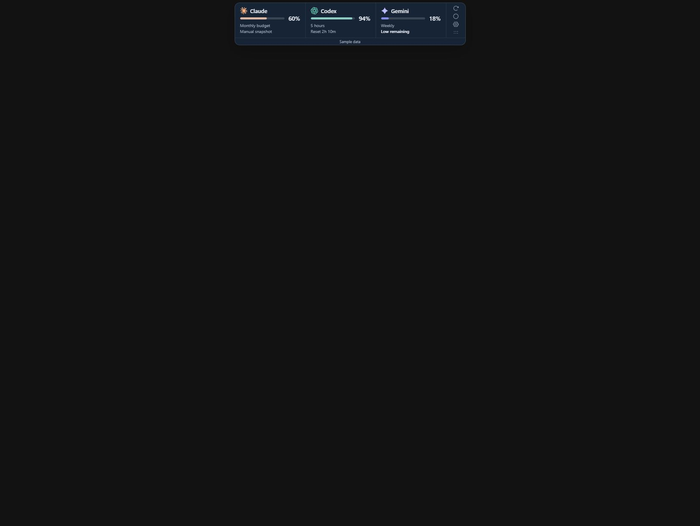
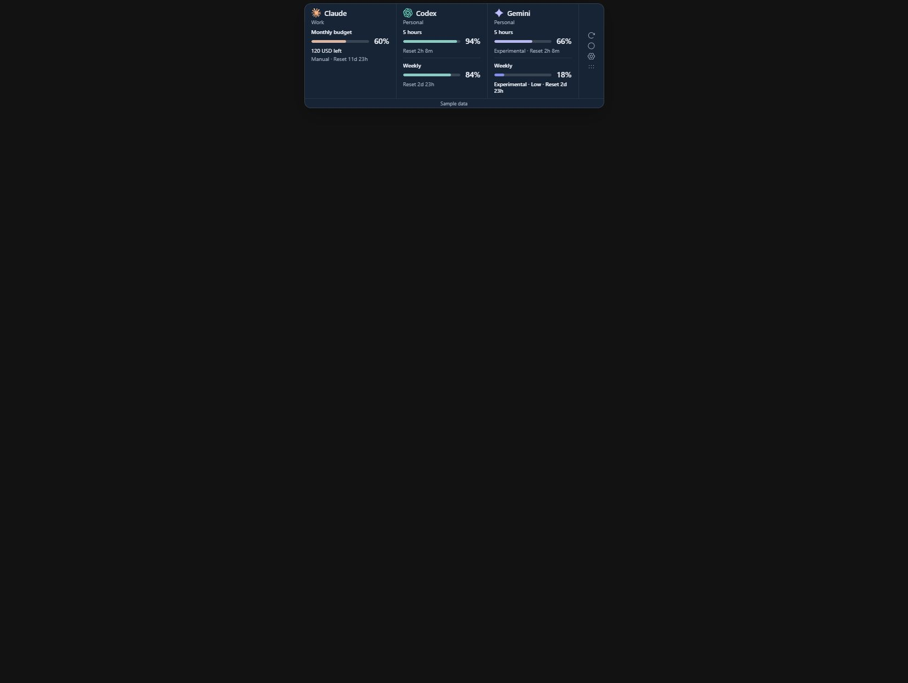
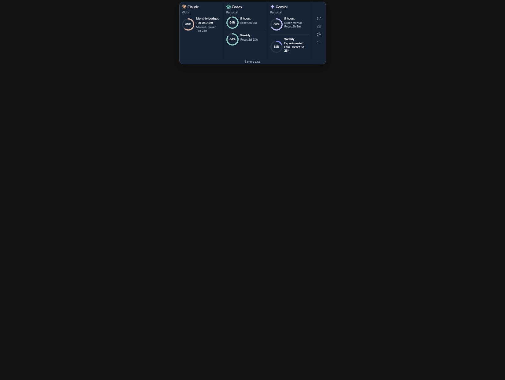

# Quota window display correction

The compact implementation displayed only the pinned quota or the first quota returned for each account. Weekly and monthly pools were accessible only after opening details. The corrected tile renders every reported quota independently; pinning changes order without hiding other pools. It never creates a monthly counter for an account that reports none.

1. **Before — incomplete visibility.** The preview used one quota per provider and the component selected one quota. This concealed the multi-window problem. [Screenshot](01-before.png).
2. **Bars — corrected.** Five-hour and weekly rows remain visible together for Codex/Gemini. A separate monthly Claude sample shows both its percentage and currency balance. Each row carries its own reset, low-remaining treatment and freshness state. [Screenshot](02-bars.png).
3. **Rings — corrected.** Each quota has its own percentage-centred gauge with period label and reset beside it; the account/logo is shared above. [Screenshot](03-rings.png).

Screenshots use clearly labelled fictional sample data, not proof of live monthly support. The revised preview includes multiple windows per account so design reviews exercise the actual data shape. Actual provider percentages are rendered from unchanged normalized Rust snapshots.

Accessibility checks: each bar is named with its provider, quota and remaining percentage; each window has a descriptive label and tooltip. Unknown balances stay as a dash, unlimited is explicit, stale/expired-login readings are labelled cached, and the pin cannot erase other windows. Reset/status captions wrap instead of silently clipping them. The account button still opens details with keyboard or pointer input. These checks do not certify full accessibility compliance; physical display scaling and screen-reader verification remain outstanding.

Validation: 21 frontend tests passed, including seven component regressions for both views, separate windows, pin order, missing pins, per-window freshness, monthly zero/unknown/unlimited and expired/disconnected accounts. TypeScript/Vite production build and Windows NSIS/portable packaging passed. A 360px browser viewport DOM check showed a 348px dock and no horizontal document overflow; the viewport screenshot was scaled incorrectly by the capture tool and was rejected rather than used as visual evidence.

The new private draft is `v0.1.0-compact.2`. The launcher uses a separate version cache to avoid starting the previous single-quota build. Native Gemini and Claude Enterprise monthly source verification remain outstanding.
